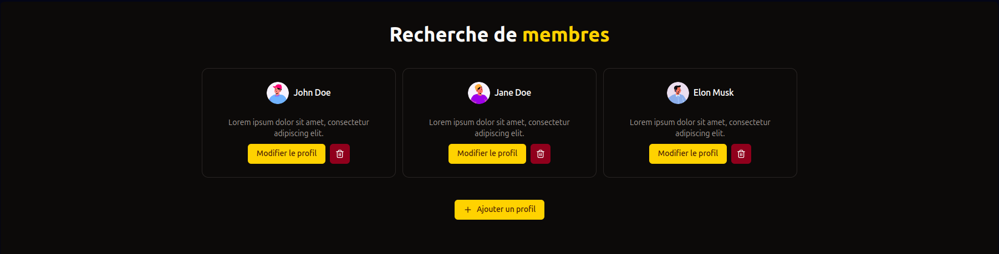

# Test technique - Mately

## Descriptif

Application React de gestion de profils (ajout, modification et suppression) réalisé avec ShadcnUI, ReactHookForm, Redux et TailwindCSS.

## Quelques images de l'application

1. Page d'accueil
   

2. Ajout d'un profil
   

3. Modification d'un profil
   

## Pré-requis

- NodeJS (version utilisée : 22.12.0)
- NPM ou PNPM

## Démarrer le projet

1. Veuillez installer les dépendances

```
npm install
```

2. Veuillez démarrer le serveur de développement

```
npm run dev
```

3. Rendez-vous sur `http://127.0.0.1:5173`
